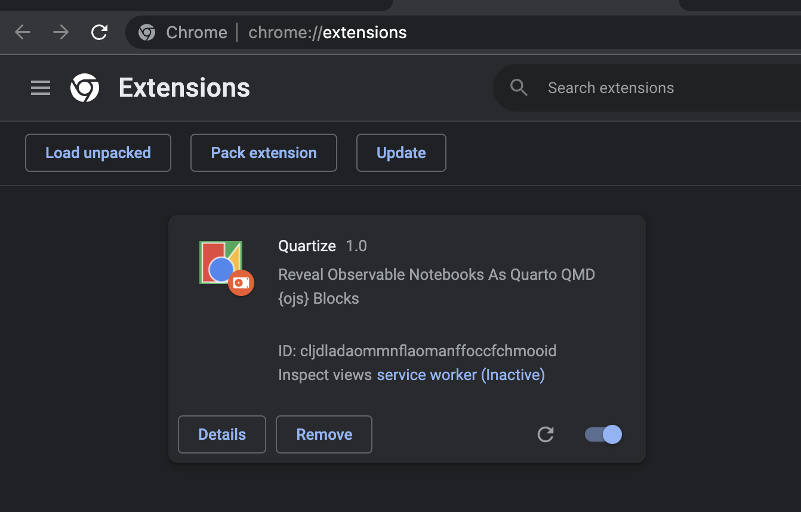
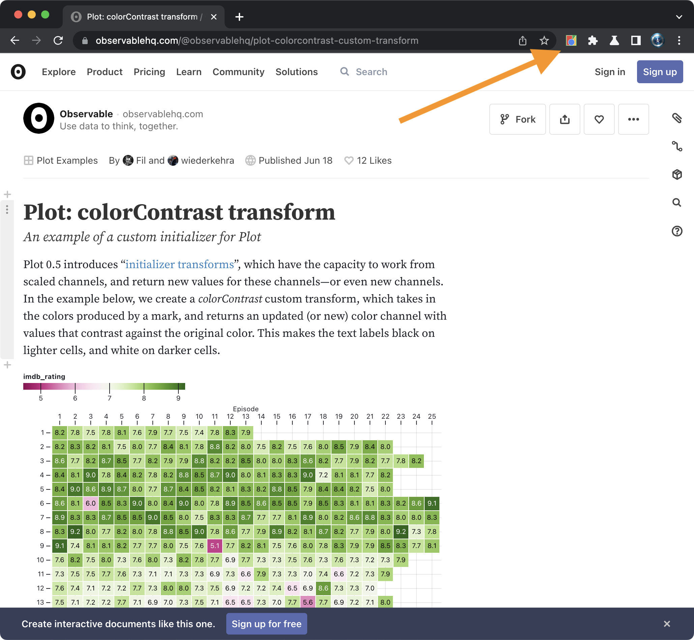
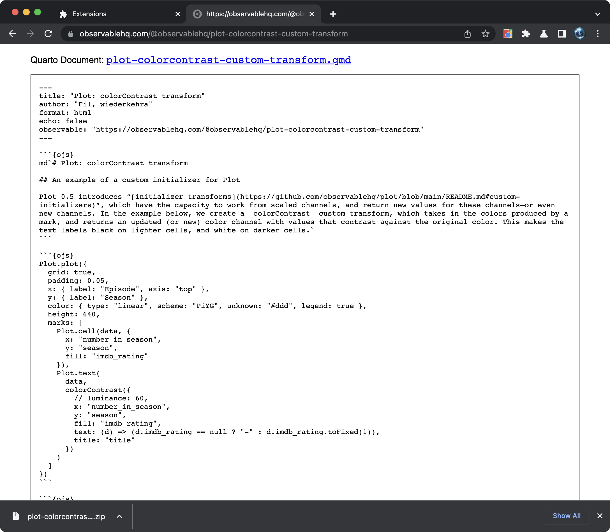

# reveal-qmd

Chrome Extension To Reveal Observable Notebooks As Quarto QMD {ojs} Blocks

## Usage:

```shell
git clone git@github.com:hrbrmstr/reveal-qmd
```

In Chrome (et al) [open up Extensions](chrome://extensions/) (`chrome://extensions/`), ensure you have "Developer Mode" enabled (upper right corner of vanilla Chrome), and load this unpacked extension. 



Click the reveal button on any Observable page and it will be transformed into a Quarto document with links to download said document and any `FileAttachment`s. A zip archive containing a Quarto project with all the `FileAttachment`s (if any will also be downloaded).

Just refresh the page to get the original Observable Notebook back.



